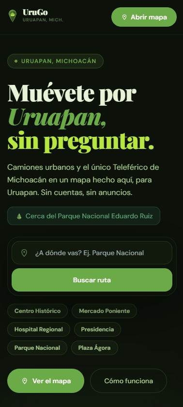

# UruGo - Rutas Uruapan


**Aplicación web progresiva (PWA) mobile-first para visualizar y navegar las 40 rutas de transporte público de Uruapan, Michoacán, junto con información del Teleférico Uruapan, sin depender de APIs externas de enrutamiento.**

## Demos

### Landing page



### Mapa interactivo


---

## El problema que resuelve

Los sistemas de transporte público en ciudades intermedias de México carecen de información digital accesible. Los pasajeros dependen del conocimiento informal para saber qué ruta tomar. **Rutas Uruapan** digitaliza las 40 rutas reales con coordenadas GPS y ofrece un motor de sugerencias A→B 100% local, sin consumir APIs de pago.

---

## ✨ Features principales

| Feature | Detalle técnico |
|---|---|
| 🗺️ Mapa interactivo | 40 rutas reales + Teleférico con coordenadas GPS en Mapbox GL JS |
| 🚡 Teleférico Integrado | Capa GeoJSON del nuevo sistema, tarjeta de información y sugerencias A→B |
| 📍 Geolocalización Inteligente | Filtra rutas a <400m del usuario, indicador de precisión y ranking de cercanía |
| 🚀 Onboarding | Overlay de bienvenida explicativo usando `localStorage` |
| 📲 Compartir Ruta | Integración con `navigator.share()` nativo y fallback al portapapeles |
| 🏷️ Nombres descriptivos | Cada ruta se identifica por su destino (ej. "Jucutacato · Ruta 24") en lista, mapa y link compartido |
| 🏛️ Landmarks y búsqueda por referencia | Indicaciones muestran puntos de referencia cercanos ("Sube cerca de Central de Autobuses"); el buscador sugiere rutas que pasan por un landmark conocido |
| 🔎 Contexto desde landing | Los CTAs y chips envían `?destino=...`; el mapa muestra una guía contextual para marcar origen y destino |
| 🔄 Ida / Vuelta | Cambio dinámico de dirección con re-render reactivo; botón de sugerencia rápida al no encontrar ruta directa |
| 🎯 Motor de sugerencias A→B | Algoritmo Haversine para matching local sin APIs externas |
| 🔀 Rutas con trasbordo | Sugerencias A→B con 1 cambio de camión; detección de intersecciones reales entre rutas (misma esquina ≤35 m); línea de caminata punteada entre puntos de bajada y abordaje; rutas secundarias atenuadas visualmente |
| 📐 Simplificación de trayectorias | Algoritmo Ramer-Douglas-Peucker (RDP) para reducir puntos en rutas de fondo |
| 🎬 Animación de trazado | Dibujo progresivo de rutas con `requestAnimationFrame` |
| 📍 Segmento relevante | Al seleccionar una sugerencia, se renderiza solo el segmento A→B |
| 🎯 Auto-encuadre de pines | La cámara ajusta el viewport automáticamente al marcar A o B |
| 🖱️ Cursor crosshair | El canvas del mapa muestra cursor de mira mientras se espera marcar A o B |
| ⚡ Lazy load de datos | El JSON maestro se carga vía `fetch("/api/rutas-polyline")` fuera del bundle JS |
| 📴 PWA completa | Service Worker con caché offline, manifest, instalable en Android/iOS |
| 🎨 UX fluida | Sin recrear layers de Mapbox: solo se actualiza el GeoJSON source |
| ✨ HeroMap animado | Card de sugerencias rotatoria con fade suave y dots indicator; bearing rotatorio del mapa |
| 🛠️ Editor de rutas (debug) | Modo visual para corregir trayectorias GPS: seleccionar segmento → dibujar reemplazo → guardar a JSON |
| 🤖 Asistente IA (UruGo Chat) | Chatbot con DeepSeek AI que responde preguntas sobre rutas, horarios y cómo llegar a destinos en Uruapan |
| 🔒 Rate limiting anti-spam | Máx. 10 mensajes por IP cada 60 s en el endpoint del chat; responde 429 con mensaje legible |
| 🚩 Reporte de errores integrado | Botón en el chat para reportar información incorrecta vía correo o GitHub Issue, con campos prellenados |
| ♿ Accesibilidad base | Estados `:focus-visible` globales para navegación por teclado y controles con labels accesibles |
| 🌗 Tema adaptativo | Respeta `prefers-color-scheme` del OS como señal primaria; fallback basado en hora del día para navegadores sin soporte |
| 🔔 Actualización de PWA | Toast "Nueva versión disponible" al detectar un SW actualizado — el usuario decide cuándo recargar |

---

---

## Flujo landing -> mapa

La landing abre la PWA en `/mapa`. Los CTAs de búsqueda y chips populares pueden enviar un destino como query param:

```txt
/mapa?destino=Parque%20Nacional
```

El mapa no inventa coordenadas ni rutas automáticas a partir de texto libre. En su lugar, muestra el destino recibido y guía al usuario a marcar primero su origen y luego la zona del destino en el mapa. Esto evita falsos positivos y mantiene el motor A→B basado en coordenadas reales.

---

## 🤖 Asistente UruGo (ChatBot IA)

Botón de chat flotante integrado en el mapa que responde preguntas en lenguaje natural sobre las rutas de Uruapan.

### Características

- Responde sobre rutas, horarios, cómo llegar a destinos y paradas conocidas
- Geolocalización opcional: sugiere rutas cercanas al usuario
- Defensa contra prompt injection y preguntas fuera de tema
- Badge **BETA** visible + aviso de que la información puede no ser exacta
- Botón 🚩 para reportar errores directamente desde el chat (abre correo o GitHub Issue prellenado)

### Variables de entorno necesarias

```bash
NEXT_PUBLIC_MAPBOX_TOKEN=pk_... # Obtener en mapbox.com
NEXT_PUBLIC_SITE_URL=https://tu-dominio.com
DEEPSEEK_API_KEY=sk-...   # Obtener en platform.deepseek.com
```

El editor interno de rutas permanece desactivado por defecto. Si necesitas usarlo en local o en un entorno privado, configura `DEBUG_ROUTE_SAVE_ENABLED=true` y protege el endpoint con `DEBUG_ROUTE_SAVE_TOKEN`.

### Seguridad

| Medida | Detalle |
|---|---|
| **CSP** | `script-src` sin `unsafe-eval`; solo `unsafe-inline` requerido por Tailwind |
| **Rate limiting** | Máx. 10 mensajes por IP cada 60 s en `/api/chat` (in-memory) |
| **Validación de entrada** | `message` limitado a 1000 caracteres; historial limitado a 20 entradas de 2000 chars c/u |
| **IP detection** | Solo headers confiables: `x-forwarded-for`, `x-real-ip`, `cf-connecting-ip` |
| **Debug endpoint** | `/api/debug/save-route` retorna 404 automáticamente en `NODE_ENV=production` |
| **Caché CDN** | `/api/rutas-polyline` usa `Cache-Control: public, max-age=3600` para servir desde edge |
| **Secrets** | Las claves API viven solo en variables de entorno (`.env` local + Vercel env vars). Nunca en el código fuente |

> **Nota:** El rate limiter usa memoria del proceso. En Vercel serverless cada instancia tiene su propio contador — para protección robusta ante abuso a escala, migrar a [Upstash Redis](https://upstash.com/) como store compartido.

### Rate limiting

El endpoint `/api/chat` limita a **10 mensajes por IP cada 60 segundos**. Si se supera, responde HTTP 429. Para ajustar el límite:

```ts
// app/api/chat/route.ts
const RATE_LIMIT = 10;       // mensajes permitidos
const RATE_WINDOW_MS = 60_000; // ventana en ms
```

### Pruebas recomendadas

```bash
npm run lint
npx tsc --noEmit
npm run build
npm audit --audit-level=moderate
```

> `npm audit` puede reportar vulnerabilidades de Next.js/PostCSS que requieren actualización controlada de dependencias. Evita `npm audit fix --force` sin revisar migración, porque puede proponer un salto mayor de Next.js.

---

## 🛠️ Editor visual de rutas (modo debug)

Herramienta de desarrollo para corregir coordenadas GPS directamente desde el mapa, sin editar JSON a mano.

### Activación

```js
// En la consola del navegador (solo en desarrollo)
localStorage.setItem('debug', 'true')
// Recargar la página
```

### Flujo de edición

1. **Selecciona una ruta** en el panel lateral — aparecen los puntos GPS numerados sobre el mapa.
2. **Haz clic en el punto de inicio** del segmento a corregir → se resalta en rojo.
3. **Haz clic en el punto final** → el segmento completo queda marcado en rojo.
4. Pulsa **"Editar segmento"** y luego haz clic en el mapa para dibujar el nuevo trayecto (verde).
5. Pulsa **"Finalizar"** → **"Aplicar"** para reemplazar el segmento.
6. Pulsa **"Guardar"** para escribir los cambios en `data/rutas_produccion_final.json`.

> El botón Guardar solo está disponible en `NODE_ENV=development`. Los cambios persisten en disco y se reflejan en el siguiente reload de la página.

---

## 🧠 Algoritmos técnicos implementados

### Haversine — Distancia esférica sobre la Tierra

Calcula la distancia en metros entre dos coordenadas GPS considerando la curvatura terrestre. Se usa para encontrar el punto de la ruta más cercano al origen (A) y al destino (B) del usuario.

```
d = 2R · arctan2(√a, √(1−a))
a = sin²(Δlat/2) + cos(lat1)·cos(lat2)·sin²(Δlng/2)
```

### Ramer-Douglas-Peucker (RDP) — Simplificación de polilíneas

Reduce la cantidad de puntos de las rutas de fondo (aquellas no seleccionadas) sin perder la forma visual. Funciona recursivamente eliminando puntos cuya distancia perpendicular a la línea entre extremos sea menor que una tolerancia configurable (`BACKGROUND_SIMPLIFY_TOLERANCE = 0.00008`).

### Motor de sugerencias A→B

1. Para cada ruta y dirección, busca el índice más cercano a A y a B usando Haversine.
2. Descarta rutas donde A o B estén a más de 550 m de la ruta.
3. Descarta rutas donde el índice de A sea posterior al de B (dirección incorrecta).
4. Calcula un **score** = `distanciaA + distanciaB × 1.8 + longitudSegmento × 0.01`.
5. Devuelve las 3 mejores opciones ordenadas por score.

### Motor de transbordos

Cuando no existe ninguna ruta directa A→B, se activa el motor de transbordos (`lib/transfers.ts`):

1. **Pre-filtro**: identifica rutas que cubren el origen (≤550 m) y rutas que cubren el destino (≤550 m).
2. **Progreso geográfico**: para cada punto de la ruta A (evaluando cada coordenada), descarta puntos cuya distancia al destino supere 1.15× la distancia origen→destino — evita que la ruta A se aleje en sentido contrario.
3. **Detección de intersección**: para cada punto válido de la ruta A, escanea las coordenadas de la ruta B (hasta el destino) usando pre-rechazo lat/lng antes de llamar a Haversine — solo se procesan puntos dentro de la ventana de 200 m.
4. **Umbral de esquina compartida**: si la distancia entre el punto de la ruta A y el punto más cercano de la ruta B es ≤35 m, se considera una intersección real (misma esquina); la penalización de caminata es casi nula.
5. **Penalidad no lineal**: distancias > 35 m se penalizan 3× para privilegiar fuertemente las transferencias en esquina.
6. **Score** = `longitudSegA + penalidad(caminata) + longitudSegB`; devuelve top 5 deduplicados por par de rutas.

### requestAnimationFrame — Animación de trazado

Al seleccionar una ruta, los puntos se añaden uno a uno al GeoJSON source en cada frame de animación, creando el efecto de "dibujo progresivo" sin bloquear el hilo principal.

---

## 🛠 Stack tecnológico

| Tecnología | Versión | Rol |
|---|---|---|
| [Next.js](https://nextjs.org/) | 16.2.4 (App Router + webpack) | Framework React con SSR/RSC y API Routes |
| [React](https://react.dev/) | 19.2.5 | Biblioteca de UI con Server Components |
| [TypeScript](https://www.typescriptlang.org/) | 5.5.3 | Tipado estático en todo el codebase |
| [Tailwind CSS](https://tailwindcss.com/) | 3.4.6 | Utilidades CSS, tema oscuro, responsivo |
| [Mapbox GL JS](https://docs.mapbox.com/mapbox-gl-js/) | 3.12.0 | Renderizado de mapas vectoriales y capas GeoJSON |
| Service Worker | nativo | Caché offline, instalación PWA |
| [DeepSeek API](https://platform.deepseek.com/) | deepseek-chat | Modelo de lenguaje para el asistente IA |

---

## 🚀 Instalación y configuración

### 1. Clonar el repositorio

```bash
git clone https://github.com/riantorres1975/rutasuruapanpwa.git
cd rutasuruapanpwa
```

### 2. Instalar dependencias

```bash
npm install
```

### 3. Configurar variables de entorno

Crea un archivo `.env.local` en la raíz del proyecto:

```bash
NEXT_PUBLIC_MAPBOX_TOKEN=pk.eyJ1IjoiTVVZX1RPS0VOX0FRVUkiLCJhIjoiZXhhbXBsZSJ9.XXXXXXXXXXXXXXXX
DEEPSEEK_API_KEY=sk-...
```

> **¿Cómo obtener el token de Mapbox?**
> 1. Crea una cuenta gratuita en [mapbox.com](https://account.mapbox.com/)
> 2. Ve a **Account → Tokens**
> 3. Copia el **Default public token** (empieza con `pk.`)
> 4. Pégalo en `.env.local` como `NEXT_PUBLIC_MAPBOX_TOKEN`
>
> El plan gratuito incluye 50,000 cargas de mapa al mes, más que suficiente para desarrollo y portafolio.

> **¿Cómo obtener la API key de DeepSeek?**
> 1. Crea una cuenta en [platform.deepseek.com](https://platform.deepseek.com/)
> 2. Ve a **API Keys** y genera una nueva clave
> 3. Pégala en `.env.local` como `DEEPSEEK_API_KEY`
>
> El modelo `deepseek-chat` tiene un costo muy bajo (~$0.014 USD por millón de tokens de entrada). Para una PWA con rate limiting, el costo mensual es mínimo.

### 4. Iniciar en desarrollo

```bash
npm run dev
```

Abre [http://localhost:3000](http://localhost:3000) en tu navegador.

### 5. Scripts útiles

```bash
npm run build                    # Build de producción (webpack)
npm run dev                      # Dev server con webpack
npm run lint                     # Validación ESLint 9
npx tsc --noEmit                 # Validación TypeScript estricta
npm audit --audit-level=moderate # Auditoría de dependencias
```

---

## 📁 Estructura del proyecto

```
rutasuruapanpwa/
├── app/
│   ├── api/rutas-polyline/route.ts     # Endpoint GET /api/rutas-polyline (datos de rutas)
│   ├── api/chat/route.ts              # Endpoint POST /api/chat — asistente IA con rate limiting
│   ├── api/debug/save-route/route.ts  # Endpoint POST para guardar ediciones (solo dev)
│   ├── robots.ts                       # Robots.txt generado por App Router
│   ├── sitemap.ts                      # Sitemap XML generado por App Router
│   ├── layout.tsx                      # Root layout, metadatos, fuentes
│   ├── mapa/page.tsx                   # Mapa interactivo con overlays y BottomSheets
│   └── page.tsx                        # Landing page
├── components/
│   ├── BottomSheet.tsx       # Sheet deslizable con lista de rutas
│   ├── ChatBot.tsx           # Asistente IA flotante con vistas chat y reporte
│   ├── Map.tsx               # MapView con Mapbox GL JS
│   ├── ReportBugForm.tsx     # Formulario de reporte de errores (correo / GitHub)
│   └── RouteList.tsx         # Lista filtrable de rutas
├── data/
│   ├── rutas_produccion_final.json # Fuente maestra del motor de rutas
│   └── gtfs/                  # Datos GTFS auxiliares / experimentales
├── lib/
│   ├── geo.ts                # Haversine y utilidades geométricas
│   ├── map.ts                # Utilidades de Mapbox (layers, sources)
│   ├── map-debug.ts          # Utilidades del editor de rutas (replaceSegment)
│   ├── transfers.ts          # Motor de transbordos con detección de intersecciones
│   └── types.ts              # Tipos TypeScript compartidos
├── public/
│   ├── manifest.json         # PWA manifest
│   ├── sw.js                 # Service Worker
│   └── icons/                # Íconos PWA (192, 512, svg)
└── scripts/
    └── test-chatbot.mjs      # Suite de tests del asistente IA
```

---

## 🏗 Decisiones técnicas

### SEO y PWA

El proyecto usa metadata de Next.js App Router, `app/sitemap.ts` y `app/robots.ts` para evitar duplicidad con archivos estáticos. El manifest vive en `public/manifest.json` y el Service Worker en `public/sw.js`, generado desde `public/sw.template.js` durante el build para estampar un identificador de versión.

El Service Worker precarga el shell principal y cachea `/api/rutas-polyline` con estrategia stale-while-revalidate para que el mapa pueda seguir funcionando después de una primera carga exitosa.

### ¿Por qué Next.js 16 con App Router?

El App Router permite colocar el endpoint `/api/rutas-polyline` en el mismo proyecto sin backend separado. Además, los **React Server Components** reducen el JS del cliente y `revalidate = 86400` en el API route garantiza que Vercel sirva el JSON desde su CDN edge — cero latencia para los usuarios. El build con webpack (`next dev --webpack`) proporciona compatibilidad completa con plugins y optimización de bundle.

### ¿Por qué Mapbox GL JS y no Leaflet o Google Maps?

Mapbox GL JS renderiza en WebGL, permitiendo 40 rutas simultáneas con animaciones fluidas a 60 fps en móviles de gama media. El modelo de capas GeoJSON separadas (una por ruta) permite actualizar solo el source de la ruta seleccionada sin re-renderizar el mapa completo.

### ¿Por qué el motor de sugerencias es local?

Las APIs de enrutamiento (Google Directions, HERE, etc.) tienen costos por request que escalan mal en una app de uso real. Dado que las rutas son fijas y conocidas, el algoritmo Haversine sobre las coordenadas locales es determinístico, instantáneo y gratuito — la búsqueda completa sobre 40 rutas tarda < 5 ms en un smartphone de gama baja.

### ¿Por qué RDP para simplificación de rutas de fondo?

Mostrar todas las rutas con su resolución completa (miles de puntos) degrada el FPS al arrastrar el mapa. RDP reduce los puntos manteniendo la forma visual percibida. Las rutas de fondo usan tolerancia `0.00008` (~8 m), la ruta seleccionada usa la resolución completa para la animación.

### ¿Por qué lazy load del JSON?

`rutas_produccion_final.json` es la fuente maestra del motor A→B. Cargarlo con `fetch("/api/rutas-polyline")` en un `useEffect` evita meter los datos de rutas en el bundle JS inicial, permite mostrar el mapa primero y deja que los datos lleguen en background.

---

## 🗺 Roadmap

- [x] **Geolocalización y Rutas Cercanas** — usar la posición GPS del usuario como punto A e indicar rutas próximas
- [x] **Integración del Teleférico** — rutas, estaciones, tiempos y visualización rica
- [x] **Compartir ruta** — integración nativa y portapapeles
- [x] **Onboarding** — guía paso a paso para usuarios nuevos
- [x] **Rutas con trasbordo** — sugerencias A→B con máximo 1 cambio de camión y visualización diferenciada
- [x] **Auto-encuadre inteligente** — la cámara se ajusta al marcar A, B o al mostrar una ruta sugerida
- [x] **Búsqueda de paradas por nombre** — campo de texto con autocomplete fuzzy
- [x] **Horarios estimados** — basados en patrones históricos de la ciudad
- [x] **Modo nocturno adaptativo** — cambio automático según hora del día
- [x] **Asistente IA** — chatbot con DeepSeek para preguntas en lenguaje natural sobre rutas
- [x] **Rate limiting** — protección anti-spam en el endpoint del asistente
- [x] **Reporte de errores en el chat** — botón 🚩 que abre correo o GitHub Issue prellenado
- [ ] **Panel de accesibilidad** — contraste alto, texto grande, screen reader

---

## 👤 Autor

**Wh0am1**

[](https://linkedin.com/in/tu-usuario)
[](https://tu-portafolio.dev)

---

---

# UruGo - Rutas Uruapan — English


**A mobile-first Progressive Web App (PWA) for visualizing and navigating the 40 public transit routes of Uruapan, Michoacán, Mexico — with no dependency on external routing APIs.**

## Demos

### Landing Page


### Interactive Map


---

## The Problem It Solves

Public transit in mid-size Mexican cities lacks accessible digital information. Passengers rely on word-of-mouth to know which bus to take. **Rutas Uruapan** digitizes all 40 real routes with GPS coordinates and provides an A→B suggestion engine that runs 100% locally — no paid routing API required.

---

## ✨ Key Features

| Feature | Technical Detail |
|---|---|
| 🗺️ Interactive map | 40 real GPS routes + new Cable Car rendered with Mapbox GL JS |
| 🚡 Teleférico Integration | GeoJSON layer for the Cable Car, rich info card, and A→B suggestions |
| 📍 Smart Geolocation | Filters routes <400m from user, accuracy indicator, and proximity ranking |
| 🚀 Onboarding Flow | Step-by-step explanatory overlay using `localStorage` |
| 📲 Share Routing | Native integration via `navigator.share()` with clipboard fallback |
| 🏷️ Descriptive names | Each route is identified by its destination (e.g. "Jucutacato · Ruta 24") in list, map, and shared link; search works by number or destination |
| 🏛️ Landmarks & reference search | Directions show nearby landmarks ("Board near Central de Autobuses"); search suggests routes passing through a known landmark |
| 🔎 Landing context | Landing CTAs and chips send `?destino=...`; the map shows contextual guidance for placing origin and destination |
| 🔄 Outbound / Return | Dynamic direction toggle with reactive re-render; quick-flip button when no direct route found |
| 🎯 A→B Suggestion Engine | Haversine-based local matching, no external APIs |
| 🔀 Transfer routes | A→B suggestions with 1 bus change; real intersection detection between routes (same corner ≤35 m); dashed walk line between alight and board points; secondary routes visually dimmed |
| 📐 Path simplification | Ramer-Douglas-Peucker (RDP) algorithm for background route decimation |
| 🎬 Route animation | Progressive drawing with `requestAnimationFrame` |
| 📍 Relevant segment | When a suggestion is selected, only the A→B segment is rendered |
| 🎯 Pin auto-framing | Camera adjusts viewport automatically when A or B is placed |
| 🖱️ Crosshair cursor | Map canvas shows crosshair cursor while waiting for A or B placement |
| ⚡ Lazy data load | Master route JSON fetched via `fetch("/api/rutas-polyline")` outside the JS bundle |
| 📴 Full PWA | Service Worker with offline cache, manifest, installable on Android/iOS |
| 🎨 Smooth UX | No Mapbox layer recreation: only the GeoJSON source is updated |
| ✨ Animated HeroMap | Rotating suggestion card with smooth fade and dots indicator; slow bearing rotation |
| 🛠️ Route editor (debug) | Visual tool to fix GPS trajectories: select segment → draw replacement → save to JSON |
| 🤖 AI Assistant (UruGo Chat) | DeepSeek-powered chatbot answering natural-language questions about routes, schedules, and destinations in Uruapan |
| 🔒 Anti-spam rate limiting | Max 10 messages per IP per 60 s on the chat endpoint; returns HTTP 429 with a readable message |
| 🚩 Integrated error reporting | Flag button in the chat that opens a pre-filled email or GitHub Issue to report incorrect information |
| ♿ Baseline accessibility | Global `:focus-visible` states for keyboard navigation and accessible labels on core controls |
| 🌗 Adaptive theme | Respects OS `prefers-color-scheme` as primary signal; time-of-day fallback for browsers without support |
| 🔔 PWA update toast | "New version available" toast on SW update — user decides when to reload |

---

## Landing -> Map Flow

The landing page opens the PWA at `/mapa`. Search CTAs and popular chips can pass a destination query param:

```txt
/mapa?destino=Parque%20Nacional
```

The map does not guess coordinates or automatic routes from free text. Instead, it displays the requested destination and guides the user to place their origin and then the destination area on the map. This keeps the A→B engine grounded in real coordinates.

---

## 🛠️ Visual Route Editor (debug mode)

A development tool for correcting GPS coordinates directly on the map — no manual JSON editing required.

### Activation

```js
// In the browser console (development only)
localStorage.setItem('debug', 'true')
// Reload the page
```

### Editing flow

1. **Select a route** in the sidebar — numbered GPS points appear over the map.
2. **Click the start point** of the segment to fix → highlighted in red.
3. **Click the end point** → the full segment is marked in red.
4. Press **"Editar segmento"** then click on the map to draw the new path (green).
5. Press **"Finalizar"** → **"Aplicar"** to replace the segment.
6. Press **"Guardar"** to write the changes to `data/rutas_produccion_final.json`.

> The Save button is only available in `NODE_ENV=development`. Changes persist to disk and are reflected on the next page reload.

---

## 🧠 Technical Algorithms

### Haversine — Spherical Distance on Earth

Calculates the distance in meters between two GPS coordinates, accounting for Earth's curvature. Used to find the route point closest to the user's origin (A) and destination (B).

```
d = 2R · arctan2(√a, √(1−a))
a = sin²(Δlat/2) + cos(lat1)·cos(lat2)·sin²(Δlng/2)
```

### Ramer-Douglas-Peucker (RDP) — Polyline Simplification

Reduces the number of points in background routes (non-selected) without losing visual shape. Works recursively by removing points whose perpendicular distance to the line between endpoints is below a configurable tolerance (`BACKGROUND_SIMPLIFY_TOLERANCE = 0.00008`).

### A→B Suggestion Engine

1. For each route and direction, finds the closest index to A and B using Haversine.
2. Discards routes where A or B are more than 550 m from the route.
3. Discards routes where the A index comes after the B index (wrong direction).
4. Calculates a **score** = `distanceA + distanceB × 1.8 + segmentLength × 0.01`.
5. Returns the top 3 options sorted by score.

### Transfer Engine

When no direct route covers A→B, the transfer engine (`lib/transfers.ts`) activates:

1. **Pre-filter**: identifies routes covering the origin (≤550 m) and routes covering the destination (≤550 m).
2. **Geographic progress**: for each coordinate of route A, discards points whose distance to the destination exceeds 1.15× the origin→destination distance — prevents route A from heading in the wrong direction.
3. **Intersection detection**: for each valid route A point, scans route B coordinates (up to the destination index) using lat/lng pre-rejection before calling Haversine — only points within the 200 m window reach the expensive calculation.
4. **Same-corner threshold**: if the distance between the route A point and the nearest route B point is ≤35 m, it qualifies as a real intersection (shared corner); walk penalty is near zero.
5. **Non-linear penalty**: distances > 35 m are penalized 3× to strongly prefer corner transfers.
6. **Score** = `lengthSegA + penalty(walk) + lengthSegB`; returns top 5 deduplicated by route pair.

### requestAnimationFrame — Route Draw Animation

When a route is selected, points are added one by one to the GeoJSON source on each animation frame, creating a "progressive drawing" effect without blocking the main thread.

---

## 🛠 Tech Stack

| Technology | Version | Role |
|---|---|---|
| [Next.js](https://nextjs.org/) | 16.2.4 (App Router + webpack) | React framework with SSR/RSC and API Routes |
| [React](https://react.dev/) | 19.2.5 | UI library with Server Components |
| [TypeScript](https://www.typescriptlang.org/) | 5.5.3 | Static typing across the entire codebase |
| [Tailwind CSS](https://tailwindcss.com/) | 3.4.6 | CSS utilities, dark mode, responsive layout |
| [Mapbox GL JS](https://docs.mapbox.com/mapbox-gl-js/) | 3.12.0 | Vector map rendering and GeoJSON layers |
| Service Worker | native | Offline cache, PWA installation |
| [DeepSeek API](https://platform.deepseek.com/) | deepseek-chat | Language model powering the AI assistant |

---

## 🚀 Installation & Setup

### 1. Clone the repository

```bash
git clone https://github.com/riantorres1975/rutasuruapanpwa.git
cd rutasuruapanpwa
```

### 2. Install dependencies

```bash
npm install
```

### 3. Set up environment variables

Create a `.env.local` file in the project root:

```bash
NEXT_PUBLIC_MAPBOX_TOKEN=pk.eyJ1IjoiWU9VUl9UT0tFTl9IRVJFIiwiYSI6ImV4YW1wbGUifQ.XXXXXXXXXXXXXXXX
DEEPSEEK_API_KEY=sk-...
```

> **How to get your Mapbox token:**
> 1. Create a free account at [mapbox.com](https://account.mapbox.com/)
> 2. Go to **Account → Tokens**
> 3. Copy the **Default public token** (starts with `pk.`)
> 4. Paste it in `.env.local` as `NEXT_PUBLIC_MAPBOX_TOKEN`
>
> The free plan includes 50,000 map loads per month — more than enough for development and portfolio use.

> **How to get your DeepSeek API key:**
> 1. Create an account at [platform.deepseek.com](https://platform.deepseek.com/)
> 2. Go to **API Keys** and generate a new key
> 3. Paste it in `.env.local` as `DEEPSEEK_API_KEY`
>
> The `deepseek-chat` model costs ~$0.014 USD per million input tokens. With rate limiting enabled, monthly costs for a real-use PWA are negligible.

### 4. Start in development

```bash
npm run dev
```

Open [http://localhost:3000](http://localhost:3000) in your browser.

### 5. Useful scripts

```bash
npm run build              # Production build (webpack)
npm run dev                # Dev server with webpack
npm run lint               # ESLint 9 validation
npx tsc --noEmit           # Strict TypeScript validation
npm audit --audit-level=moderate # Dependency audit
```

---

## 🔒 Security

| Measure | Detail |
|---|---|
| **CSP** | `script-src` without `unsafe-eval`; only `unsafe-inline` required by Tailwind |
| **Rate limiting** | Max 10 messages per IP per 60 s on `/api/chat` (in-memory) |
| **Input validation** | `message` capped at 1000 chars; history limited to 20 entries of 2000 chars each |
| **IP detection** | Only trusted headers: `x-forwarded-for`, `x-real-ip`, `cf-connecting-ip` |
| **Debug endpoint** | `/api/debug/save-route` automatically returns 404 in `NODE_ENV=production` |
| **CDN cache** | `/api/rutas-polyline` uses `Cache-Control: public, max-age=3600` to serve from edge |
| **Secrets** | API keys live only in environment variables (local `.env` + Vercel env vars). Never in source code |

> **Note:** The rate limiter uses process memory. On Vercel serverless, each instance maintains its own counter — for robust abuse protection at scale, migrate to [Upstash Redis](https://upstash.com/) as a shared store.

---

## 📁 Project Structure

```
rutasuruapanpwa/
├── app/
│   ├── api/rutas-polyline/route.ts     # GET /api/rutas-polyline endpoint
│   ├── api/chat/route.ts               # POST /api/chat endpoint with rate limiting
│   ├── api/debug/save-route/route.ts  # POST endpoint for saving edits (dev only)
│   ├── robots.ts                       # robots.txt generated by App Router
│   ├── sitemap.ts                      # sitemap.xml generated by App Router
│   ├── layout.tsx                      # Root layout, metadata, fonts
│   ├── mapa/page.tsx                   # Interactive map and PWA flow
│   └── page.tsx                        # Landing page
├── components/
│   ├── BottomSheet.tsx       # Slide-up sheet with route list
│   ├── ChatBot.tsx           # Floating AI assistant
│   ├── Map.tsx               # MapView with Mapbox GL JS
│   ├── ReportBugForm.tsx     # Error report form
│   └── RouteList.tsx         # Filterable route list
├── data/
│   ├── rutas_produccion_final.json # Master route engine data
│   └── gtfs/                  # Auxiliary / experimental GTFS data
├── lib/
│   ├── geo.ts                # Haversine and geometric utilities
│   ├── map.ts                # Mapbox utilities (layers, sources)
│   ├── map-debug.ts          # Route editor utilities (replaceSegment)
│   ├── transfers.ts          # Transfer engine with intersection detection
│   └── types.ts              # Shared TypeScript types
├── public/
│   ├── manifest.json         # PWA manifest
│   ├── sw.js                 # Service Worker
│   └── icons/                # PWA icons (192, 512, svg)
└── scripts/
    └── test-chatbot.mjs      # AI assistant test suite
```

---

## 🏗 Technical Decisions

### SEO and PWA

The project uses Next.js App Router metadata, `app/sitemap.ts`, and `app/robots.ts` to avoid duplicate static SEO files. The manifest lives in `public/manifest.json`; the Service Worker lives in `public/sw.js` and is generated from `public/sw.template.js` during build to stamp a version identifier.

The Service Worker precaches the main shell and caches `/api/rutas-polyline` with stale-while-revalidate so the map can keep working after one successful online load.

### Why Next.js 16 with App Router?

The App Router lets us place the `/api/rutas-polyline` endpoint within the same project — no separate backend. Additionally, **React Server Components** reduce client-side JS, and `revalidate = 86400` on the API route ensures Vercel serves the JSON from its edge CDN, delivering zero-latency responses to users. The webpack-based build (`next dev --webpack`) provides full plugin compatibility and bundle optimization.

### Why Mapbox GL JS instead of Leaflet or Google Maps?

Mapbox GL JS renders via WebGL, enabling 40 simultaneous routes with smooth 60 fps animations on mid-range smartphones. The GeoJSON layer-per-route model allows updating only the selected route's source without re-rendering the entire map.

### Why a local suggestion engine?

Routing APIs (Google Directions, HERE, etc.) have per-request costs that scale poorly for a real-use app. Since the routes are fixed and known, the Haversine algorithm over local coordinates is deterministic, instantaneous, and free — a full search across 40 routes takes less than 5 ms on a low-end smartphone.

### Why RDP for background route simplification?

Rendering all routes at full resolution (thousands of points) degrades FPS when panning the map. RDP reduces points while preserving visual shape. Background routes use a tolerance of `0.00008` (~8 m); the selected route uses full resolution for its draw animation.

### Why lazy-load the JSON?

`rutas_produccion_final.json` is the master source for the A→B engine. Loading it with `fetch("/api/rutas-polyline")` inside a `useEffect` keeps route data out of the initial JS bundle, lets the map render first, and loads data in the background.

---

## 🗺 Roadmap

- [x] **Geolocation & Nearby Routes** — automatically use the user's GPS position and list nearby buses
- [x] **Cable Car Integration** — map overlay, station info, times, and rich presentation
- [x] **Share route** — native share sheet integration and clipboard support
- [x] **Onboarding** — guide for first-time users
- [x] **Transfer routes** — A→B suggestions with up to 1 bus change, with dimmed secondary-route styling
- [x] **Smart camera framing** — viewport auto-adjusts when A or B are placed, or when a suggested route is selected
- [x] **AI Assistant** — DeepSeek-powered chatbot for natural-language route queries
- [x] **Rate limiting** — anti-spam protection on the chat endpoint
- [x] **In-chat error reporting** — 🚩 button pre-filling email or GitHub Issue
- [ ] **Stop search by name** — text field with fuzzy autocomplete
- [ ] **Adaptive dark mode** — automatic switch based on time of day
- [ ] **Accessibility panel** — high contrast, large text, screen reader support

---

## 👤 Author

**Wh0am1**

[](https://linkedin.com/in/your-username)
[](https://your-portfolio.dev)
