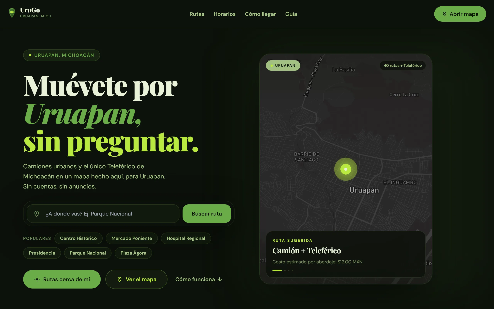
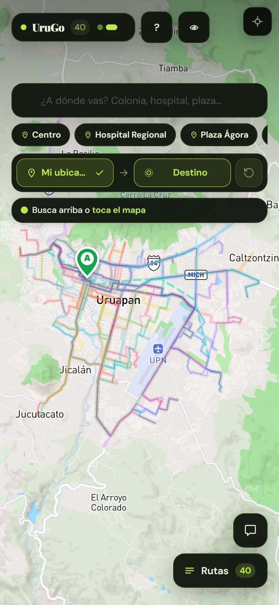
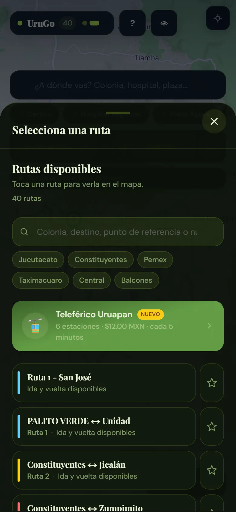
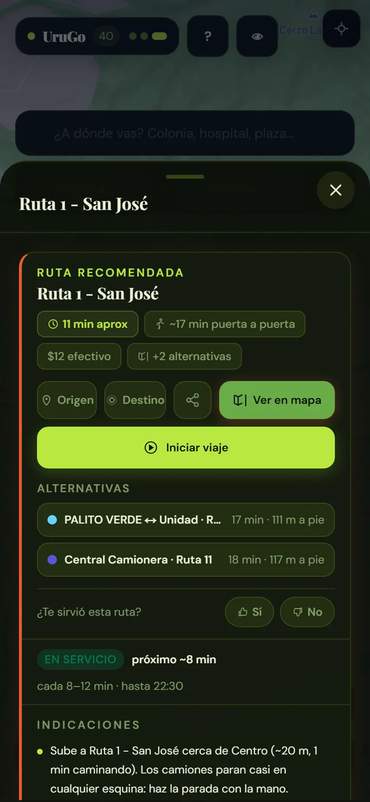
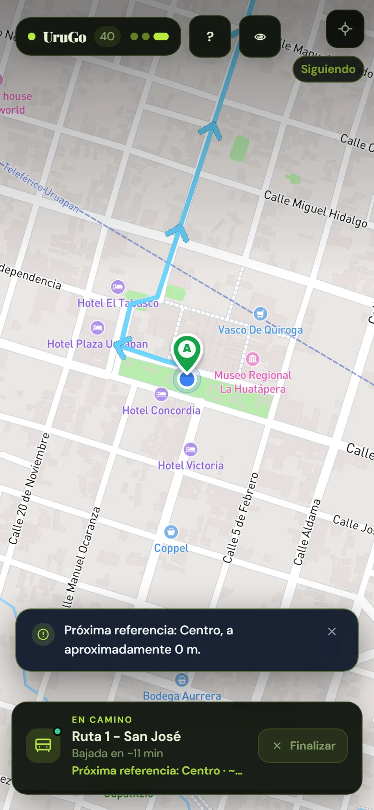
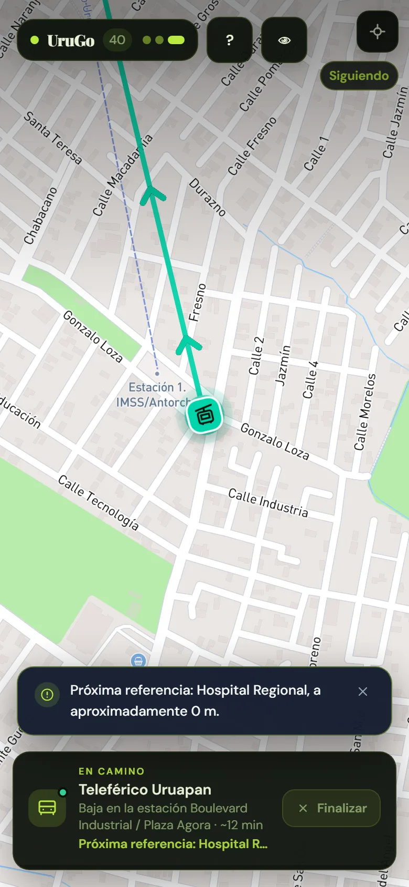
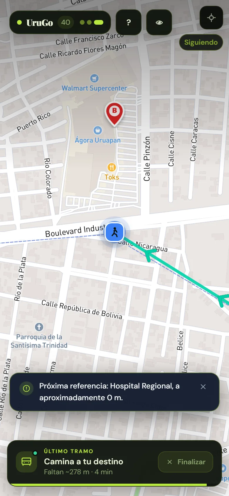
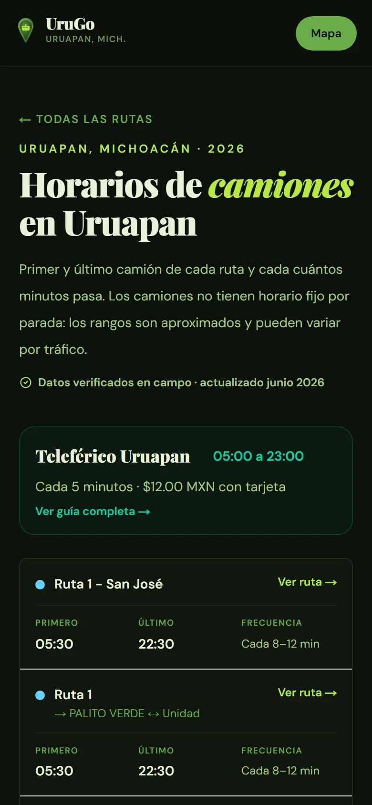
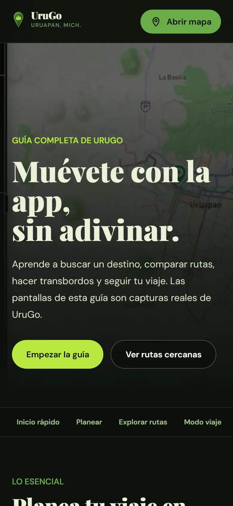

# UruGo

<p align="right">
  <a href="./README.en.md">English version</a>
</p>

UruGo es una aplicación web para consultar las rutas de transporte público de Uruapan, Michoacán. Reúne en un solo lugar los recorridos de camiones, el Teleférico, horarios aproximados y una herramienta para calcular opciones entre un origen y un destino.

[Abrir UruGo](https://www.urugo.app) · [Ver el mapa](https://www.urugo.app/mapa)

## Vista previa

<p align="center">
  
</p>

<p align="center"><sub>Busca un destino, compara alternativas y abre el recorrido directamente en el mapa.</sub></p>

<table>
  <tr>
    <th>Mapa interactivo</th>
    <th>Selector de rutas</th>
    <th>Resultado del viaje</th>
  </tr>
  <tr>
    <td align="center"></td>
    <td align="center"></td>
    <td align="center"></td>
  </tr>
  <tr>
    <th>Modo viaje: camión</th>
    <th>Modo viaje: Teleférico</th>
    <th>Último tramo a pie</th>
  </tr>
  <tr>
    <td align="center"></td>
    <td align="center"></td>
    <td align="center"></td>
  </tr>
</table>

<table>
  <tr>
    <th>Horarios</th>
    <th>Guía de uso</th>
  </tr>
  <tr>
    <td align="center"></td>
    <td align="center"></td>
  </tr>
</table>

## Qué ofrece

- Mapa interactivo con las 40 rutas urbanas y el recorrido del Teleférico de Uruapan.
- Búsqueda por número de ruta, destino, colonia y puntos de referencia conocidos.
- Cálculo local de opciones entre dos puntos, sin depender de una API externa de direcciones.
- Sugerencias de rutas directas y viajes con un transbordo.
- Comparación por distancia a pie, tiempo estimado y costo del viaje.
- Consulta de horarios, frecuencia y estado de servicio por ruta.
- Rutas favoritas, lugares guardados y viajes recientes almacenados en el dispositivo.
- Enlaces compartibles que conservan la ruta, dirección, origen y destino.
- Instalación como PWA y una vista básica del recorrido cuando no hay conexión.
- Asistente opcional para preguntas sobre transporte, limitado a los datos disponibles en el proyecto.

La ubicación del dispositivo solo se usa como origen automático cuando se encuentra dentro del área de servicio de Uruapan. Si el usuario está en otra ciudad, la aplicación conserva el destino y solicita que marque manualmente un origen dentro de Uruapan.

## Cómo funciona el cálculo de rutas

Los recorridos se almacenan como polilíneas GPS en `data/rutas_produccion_final.json`. Para cada consulta, el motor:

1. Busca los puntos de cada recorrido más cercanos al origen y al destino.
2. Descarta rutas demasiado alejadas o que circulan en el sentido contrario.
3. Ordena las opciones por caminata y longitud útil del trayecto.
4. Si no encuentra una ruta directa, busca una combinación con un transbordo razonable.

El cálculo se realiza en el cliente con los datos del proyecto. Mapbox se utiliza para dibujar el mapa y para la búsqueda geográfica, pero no para decidir qué camión tomar.

## Tecnologías

| Tecnología | Uso |
| --- | --- |
| Next.js 16 y React 19 | Aplicación, páginas públicas y endpoints internos |
| TypeScript | Tipos compartidos y lógica del motor de rutas |
| Tailwind CSS | Estilos y diseño adaptable |
| Mapbox GL JS | Mapa vectorial, capas y marcadores |
| Vitest | Pruebas de geometría, horarios, búsqueda y almacenamiento |
| Service Worker | Instalación y caché de la PWA |
| Vercel Analytics | Métricas de uso y rendimiento |
| Supabase | Reportes comunitarios, autenticación administrativa e historial de rutas |
| Resend y Vercel Cron | Resumen diario de elementos pendientes para administración |

## Puesta en marcha

### Requisitos

- Node.js 20.9 o posterior.
- pnpm 11.
- Una cuenta de Mapbox y un token público.
- Una clave de DeepSeek únicamente si se quiere habilitar el asistente.

### Instalación

```bash
git clone https://github.com/riantorres1975/rutasuruapanpwa.git
cd rutasuruapanpwa
pnpm install
```

El proyecto fija pnpm 11.19.0 y conserva las versiones exactas en `pnpm-lock.yaml`. La instalación rechaza versiones publicadas durante las últimas 24 horas y solo ejecuta scripts de dependencias aprobados expresamente.

Copia `.env.example` como `.env.local` y completa, como mínimo, el token de Mapbox:

```bash
NEXT_PUBLIC_MAPBOX_TOKEN=pk.tu_token_publico
NEXT_PUBLIC_SITE_URL=http://localhost:3000
```

Después inicia el servidor de desarrollo:

```bash
pnpm dev
```

La aplicación estará disponible en [http://localhost:3000](http://localhost:3000).

## Variables de entorno

| Variable | Obligatoria | Descripción |
| --- | --- | --- |
| `NEXT_PUBLIC_MAPBOX_TOKEN` | Sí | Token público para el mapa y la búsqueda de lugares |
| `NEXT_PUBLIC_SITE_URL` | No | URL base usada en metadatos y enlaces compartidos |
| `DEEPSEEK_API_KEY` | No | Habilita el asistente de transporte |
| `UPSTASH_REDIS_REST_URL` | No | Backend Redis opcional, con prioridad sobre Supabase para el límite de solicitudes |
| `UPSTASH_REDIS_REST_TOKEN` | No | Token del backend Redis opcional |
| `RATE_LIMIT_HASH_SECRET` | No | Secreto HMAC dedicado para anonimizar las claves del rate limit; usa `REPORTER_HASH_SECRET` como respaldo |
| `ERROR_ALERT_WEBHOOK_URL` | No | Webhook HTTPS para alertas de errores críticos del cliente |
| `ERROR_ALERT_WEBHOOK_TOKEN` | No | Token Bearer opcional para autenticar el webhook |
| `DEBUG_ROUTE_SAVE_ENABLED` | No | Activa el guardado del editor de recorridos en desarrollo |
| `DEBUG_ROUTE_SAVE_TOKEN` | No | Protege el endpoint del editor cuando está habilitado |
| `NEXT_PUBLIC_SUPABASE_URL` | No | URL del proyecto que habilita reportes y administración |
| `NEXT_PUBLIC_SUPABASE_PUBLISHABLE_KEY` | No | Clave pública usada para iniciar la sesión administrativa |
| `SUPABASE_SECRET_KEY` | No | Clave privada de servidor para persistencia y moderación |
| `ADMIN_EMAILS` | No | Correos autorizados para entrar al panel, separados por comas |
| `CRON_SECRET` | No | Secreto que protege las tareas programadas de Vercel |
| `RESEND_API_KEY` | No | Clave privada de Resend para enviar el resumen administrativo diario |
| `ADMIN_NOTIFICATION_FROM` | No | Remitente verificado en Resend, por ejemplo `UruGo <avisos@auth.urugo.app>` |
| `ADMIN_NOTIFICATION_EMAILS` | No | Destinatarios del resumen, separados por comas; si se omite usa `ADMIN_EMAILS` |
| `REPORTER_HASH_SECRET` | No | Secreto para anonimizar la IP de quien contribuye |
| `ROUTE_DATA_SOURCE` | No | `static` por defecto; usa `supabase` después de importar y verificar las rutas |

El token público de Mapbox debe restringirse por dominio desde el panel de Mapbox. Las claves privadas no deben usar el prefijo `NEXT_PUBLIC_` ni incluirse en el repositorio.

El resumen administrativo se programa una vez al día y sólo se envía cuando existen reportes o señales por revisar. Requiere `CRON_SECRET`, `RESEND_API_KEY` y un remitente de un dominio verificado en Resend.

En producción conviene configurar Upstash para que los límites de solicitudes se compartan entre todas las instancias. El webhook operativo es opcional: recibe únicamente errores críticos de React, deduplicados por huella durante 15 minutos, sin mensajes, trazas ni ubicación del usuario.

## Comandos disponibles

```bash
pnpm dev               # servidor local con recarga automática
pnpm build             # compilación de producción
pnpm start             # inicia la compilación de producción
pnpm lint              # revisión estática con ESLint
pnpm test              # ejecuta la suite de Vitest
pnpm test:admin-integration # modera un reporte contra un Supabase exclusivo de pruebas
pnpm api-key:create -- "Nombre" # emite una clave para aportes externos moderados
pnpm guide:screenshots # actualiza las capturas de la aplicación
pnpm db:seed-routes     # importa el JSON actual en Supabase
```

## Estructura del proyecto

```text
app/                  páginas, layouts y endpoints de Next.js
components/           mapa, buscadores, paneles y controles reutilizables
data/                  recorridos GPS y datos auxiliares de transporte
hooks/                 favoritos y enlaces compartidos
lib/                   geometría, horarios, búsqueda y motor de rutas
public/                manifest, Service Worker, iconos y recursos públicos
tests/                 pruebas automatizadas
supabase/              migraciones reproducibles de la base de datos
```

Los módulos principales son:

- `app/mapa/page.tsx`: coordina el flujo de origen, destino y resultados.
- `components/Map.tsx`: administra Mapbox, capas, marcadores y encuadre.
- `lib/routeMatcher.ts`: evalúa y ordena las rutas directas.
- `lib/transfers.ts`: busca combinaciones con un transbordo.
- `lib/geo.ts`: distancias y validación del área de servicio.
- `lib/schedules.ts`: horarios y estado estimado de operación.

## Datos y correcciones

`data/rutas_produccion_final.json` se conserva como respaldo incluido en la aplicación. En producción, Supabase puede entregar las versiones publicadas y el servidor vuelve automáticamente al JSON si la fuente remota no está disponible. El proyecto también incluye un editor visual local cuyo endpoint de guardado permanece deshabilitado por defecto.

Los reportes sobre rutas, horarios o puntos incorrectos pueden enviarse desde la página [`/reportar-error`](https://www.urugo.app/reportar-error). Cuando Supabase está configurado quedan pendientes en el panel privado; ningún reporte modifica directamente el mapa. La guía de configuración está en [`docs/community-data.md`](./docs/community-data.md).

La consulta pública versionada está documentada en [`/datos-api`](https://www.urugo.app/datos-api). `GET /api/v1/routes` admite CORS, caché y validación condicional mediante `ETag`; las escrituras permanecen limitadas al formulario de UruGo y siempre requieren moderación.

### Estado del sistema comunitario

Actualmente están operativos:

- Formularios públicos para reportar errores, rutas faltantes y cambios de servicio.
- Confirmaciones rápidas desde las fichas de ruta, con deduplicación y revisión administrativa.
- Acceso privado por enlace de correo, bandejas de moderación y bitácora de decisiones.
- Historial agregado por colaborador anónimo, sin mostrar IP ni identificadores técnicos.
- Inventario priorizado por antigüedad, estado operativo y evidencia comunitaria aceptada.
- Publicación versionada de recorridos, restauración de versiones anteriores y respaldo administrativo en JSON.
- API pública de sólo lectura con los recorridos aprobados.
- Resumen diario protegido mediante Vercel Cron y Resend; no envía correo cuando no hay pendientes.
- Limpieza diaria de contadores técnicos vencidos para mantener el rate limit sano entre instancias.
- Retención automática de reportes, señales y bitácoras privadas con plazos publicados en el aviso de privacidad.
- Prueba E2E administrativa opt-in contra un proyecto Supabase aislado, con creación y limpieza de datos temporales.
- API autenticada para que integraciones autorizadas envíen propuestas con cuota propia y moderación obligatoria.

Trabajo pendiente:

- Verificar en campo las rutas antiguas o dudosas y registrar una fecha de revisión por recorrido.
- Procesar los reportes reales de la comunidad y convertir únicamente los comprobados en nuevas versiones públicas.
- Configurar el proyecto Supabase de pruebas en CI para ejecutar automáticamente la prueba administrativa aislada.
- Añadir al panel la creación, revocación y ajuste de cuotas de integraciones API; por ahora se administran por script y SQL.
- Mantener aplazado el seguimiento GPS colaborativo de camiones hasta definir consentimiento, consumo de batería, privacidad y controles contra ubicaciones falsas.

### Generar puntos de referencia

Los puntos de referencia de las rutas pueden regenerarse desde OpenStreetMap sin sobrescribir los que ya fueron verificados manualmente:

```bash
pnpm landmarks:review  # genera .cache/landmarks-review.json
pnpm landmarks:apply   # aplica las propuestas a rutas sin referencias
```

Los lugares generados incluyen datos de [OpenStreetMap](https://www.openstreetmap.org/copyright), disponibles bajo ODbL 1.0, y deben revisarse antes de publicarse.

## Alcance y limitaciones

- UruGo es un proyecto independiente; no pertenece al Ayuntamiento de Uruapan ni a los operadores de transporte.
- Los horarios de camiones son aproximados y pueden cambiar por tráfico, demanda o decisiones operativas.
- No todas las paradas están formalmente señalizadas o mapeadas.
- Los mapas base de Mapbox requieren conexión, aunque algunos datos y recorridos pueden quedar en caché.
- Las sugerencias sirven como orientación y deben contrastarse con las condiciones reales del servicio.

## Calidad

Antes de enviar cambios se recomienda ejecutar:

```bash
pnpm lint
pnpm test
pnpm build
```

El repositorio también ejecuta estas verificaciones mediante GitHub Actions.
